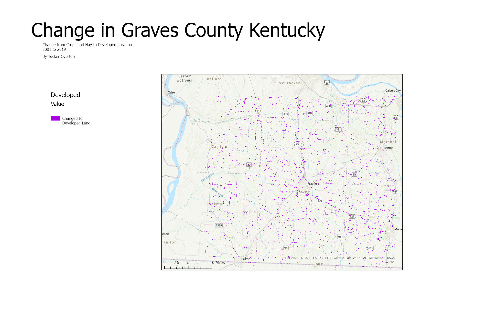

# My area of change
## My subtitle about the change

This map is showing the change in Graves county Kentucky from 2001 to 2019. The specific
change that this is showing is pasture, hay, and farm land changeing into developed land. Originally
I was going to see how much developed turned back into pasture, hay, and farm land, but it was a very 
small amount.  

     
*Change in Graves*

[Link to high-resolution version](Layout1.pdf)     

Information about the author and data sources used in the analysis.